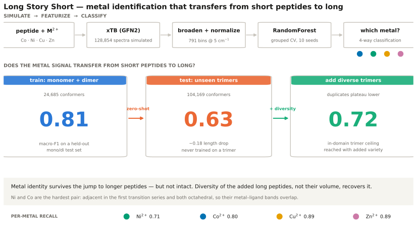
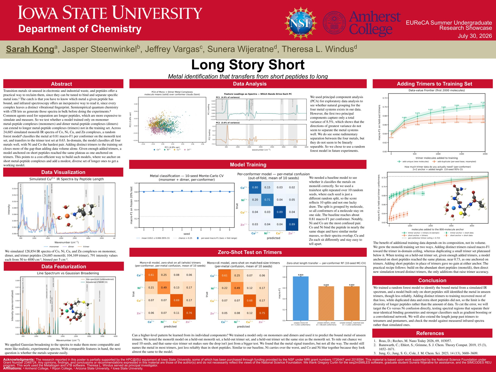
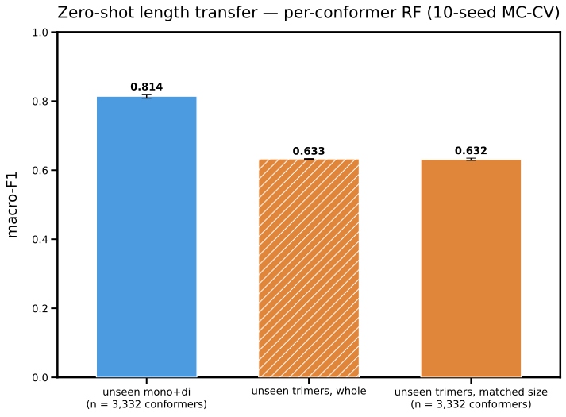
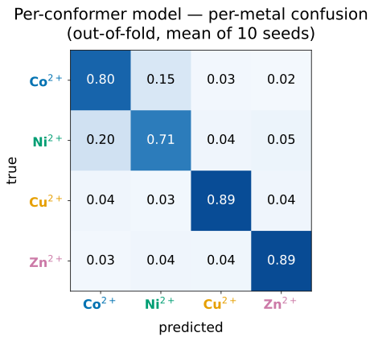
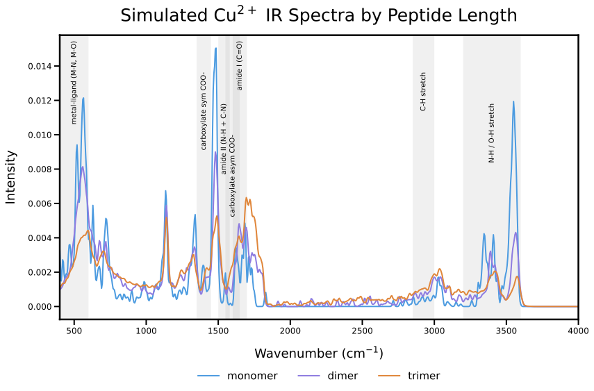

# Long Story Short: metal identification that transfers from short peptides to long

This repository contains code and analysis notebooks for: predicting which transition metal a
peptide complex has bound from its simulated IR spectrum, and measuring how far that
identification carries as the peptide grows longer — from short peptides (cheap to simulate) to
long ones (expensive, and closer to a real separation system).

## Graphical Overview



Regenerate with `python tools/make_graphical_overview.py` — every number is read from `output/`
and `data/processed/` at build time, so the figure cannot drift away from the results.

Presented at the EUReCA Summer Undergraduate Research Showcase, Iowa State University,
30 July 2026. Print-quality version: [`figures/poster.pdf`](figures/poster.pdf) (48 × 36 in).

[](figures/poster.pdf)

Sarah Kong¹, Jasper Steenwinkel², Jeffrey Vargas³, Sunera Wijeratne⁴, Theresa L. Windus⁴
— ¹ Amherst College, ² Ripon College, ³ Arizona State University, ⁴ Iowa State University

The headline result: a RandomForest trained only on monomers and dimers, transferring to trimers
it has never seen. All 11 panels are in [`figures/`](figures/).







## Project Overview

This project aimed towards identifying which transition metal a peptide has bound using only the
infrared spectrum as a fingerprint, and measuring how far that identification carries as the
peptide grows longer. Recovering transition metals from mixed electronic and industrial waste
needs a way to separate chemically similar metals, and one route is a peptide that selectively
binds one metal over another. Knowing which metal a given peptide has grabbed is a step towards
designing those peptides, and the IR spectrum is a convenient readout.

The model system is four divalent metals (Co²⁺, Ni²⁺, Cu²⁺, Zn²⁺) on peptides, with metal-free
apo peptides as a baseline. Every spectrum was simulated with the semi-empirical method xTB
(GFN2), which reaches trimers where accurate DFT stops at dimers. The generalization axis is
peptide length: monomer → dimer → trimer.

The main avenues investigated:

1. **Classify the bound metal** from a simulated IR spectrum with a per-conformer RandomForest,
   and read which spectral regions carry the signal (PCA loadings, per-metal confusion).
2. **Measure zero-shot length transfer** — train on monomers and dimers, then classify the metal
   of a trimer the model never saw.
3. **Find a cost-efficient recipe** — how many trimers must be added to training to close the
   length gap, and whether cheap short peptides can substitute for expensive long ones.

Headline numbers: across 24,685 simulated mono/di spectra the classifier reaches **0.81 macro-F1**
on a held-out mono/di test set and transfers to unseen trimers at **0.63**, a length drop of about
0.18. Ni and Co are the hardest pair — they are adjacent in the first transition series and both
sit octahedral, so their metal–ligand bands overlap. Adding a modest, *diverse* set of trimers
closes most of the gap while duplicating a small set does not, which supports anchoring on cheap
short peptides and topping up with a few longer ones.

## Repository Layout

**Everything below runs on a fresh clone** — the dataset is committed, so no script, notebook or
test needs the raw xTB tables.

### Example data (`data/`)

Every table is metadata columns followed by the 791 raw stick intensities `spec_50 … spec_4000`;
broadening is applied at load time. Full details in [`data/README.md`](data/README.md).

```
data/processed/molecules.csv                    : 9,060 rows — one spectrum per molecule (lowest free energy)
data/processed/conformers_monodi.csv.gz         : 24,685 rows — every mono+dimer conformer (uncapped)
data/processed/conformers_trimers_cap10.csv.gz  : 69,520 rows — trimer conformers, capped at 10/molecule
data/teaching/molecules.csv                     : 360-row stratified subset for the teaching notebook
data/processed/dataset_manifest.json            : what was simulated vs what shipped, per length, + build settings
```

The manifest matters because the trimer table ships capped: 104,169 simulated conformers become
69,520 on disk, and counting rows would under-report the dataset. Read it with
`processed.load_manifest()` rather than hardcoding a size.

### Package (`src/irspectra/`)

Layered so dependencies run one way — `viz` and `modeling` may import `data`, never the reverse.

```
src/irspectra/paths.py             : Resolves data/, output/ and figures/ from the repo root
src/irspectra/config.py            : Modelling protocol — METAL_ORDER, the 10 seeds, RF params, ci95()
src/irspectra/data/spectra.py      : The 791-point wavenumber grid, IR band table, broaden + normalize
src/irspectra/data/processed.py    : Molecule-level loaders over the committed CSVs
src/irspectra/data/conformers.py   : Per-conformer loaders + the conformer → molecule collapsers
src/irspectra/modeling/protocol.py : Shared --cap/--aggregate flags, filename suffixes, the data loader
src/irspectra/modeling/metrics.py  : macro_f1 / per_metal_f1 with the label set pinned to METAL_ORDER
src/irspectra/viz/palette.py       : Metal colours and math-rendered labels (Okabe-Ito, colorblind-safe)
src/irspectra/viz/panels.py        : The shared confusion-matrix heatmap and IR-band annotation
src/irspectra/results.py           : Loads the model-result CSV/JSON tables from output/
```

### Pipeline (`pipeline/`)

One entry point per step. Steps 5–6 **require `--cap 10`** — without it each script writes a
differently-named, uncapped result that neither the notebook nor the tests read.

```
step3_pca_coords.py             : Fits the PCA and saves PC1–PC10 coords + explained variance
step3_pca_means.py              : Re-plots those saved coords as molecule means over conformer clouds
step3_pca_loadings.py           : Plots the PC1/PC2 loading vectors as spectra
step4_cv_macrof1.py             : 10-seed Monte-Carlo CV, macro-F1 (uncapped — the 0.81 headline)
step4_confusion_perconformer.py : Out-of-fold per-metal confusion matrix (K=10 cap)
step5_zeroshot.py               : Zero-shot length transfer, three test sets, 10 seeds
step5_confusion_part.py         : Confusion on a size-matched trimer subsample
step5_confusion_whole.py        : Confusion on every trimer conformer, plus its heatmap
step6_frontier.py               : Data-value frontier — unique vs duplicated trimers added to training
step6_length_substitution.py    : 2×2 anchor-length × added-length substitution study
```

Order matters in two places: `step3_pca_coords.py` must precede `step3_pca_means.py` (which only
re-plots), and `tune_rf_bo.py` must precede anything that reads `RF_PARAMS`.

### Tools (`tools/`) — run out-of-band, not pipeline stages

```
build_dataset.py           : Turns the raw xTB tables into the committed CSVs. The ONLY code that opens a raw table
tune_rf_bo.py              : Bayesian-optimization RF hyperparameter search → output/step2/best_params.json
make_teaching_subset.py    : Carves the 360-molecule teaching subset out of data/processed/
make_graphical_overview.py : Builds figures/graphical_overview.svg from the numbers in output/
```

### Notebooks (`notebooks/`)

```
teaching_notebook.ipynb : Walks Steps 1–6 end to end on data/teaching/molecules.csv. Start here —
                          no raw data needed, runs in about a minute, and each step explains the
                          chemistry as well as the code. Ends with 5 exercises.
figure_notebook.ipynb   : Rebuilds the 11 poster figures from output/. Each panel has a CONFIG dict
                          at the top of its cell (colors, titles, fonts, filename) — edit it, run
                          the cell, and the matching .svg in figures/ is rewritten.
```

### Everything else

```
run_all.py : The whole pipeline in dependency order with the flags that reproduce output/.
             `python run_all.py --dry-run` prints the plan; `--from step4` resumes partway.
output/    : The metrics the pipeline writes (step2..step6), committed so the figures rebuild
figures/   : The 11 exported .svg panels, plus poster.jpg / poster.pdf
tests/     : pytest smoke tests over the committed dataset and result tables
```

## Requirements

```
pip install -e .                 # numpy, pandas, scipy, scikit-learn, matplotlib
pip install -r requirements.txt  # + optuna (tuning), jupyterlab (notebooks), pytest (tests)
```

Python ≥ 3.10.

## Acknowledgement

The research reported in this poster is partially supported by the HPC@ISU equipment at Iowa
State University, some of which has been purchased through funding provided by the NSF under MRI
grant numbers 1726447 and 2018594. This material is based upon work supported by the National
Science Foundation under Grant Number 2348724. Any opinions, findings, and conclusions or
recommendations expressed in this material are those of the author(s) and do not necessarily
reflect the views of the National Science Foundation.

We thank Gregory Curtin for the seq2mSMILES software, graduate student Sunera Wijeratne for
assistance, and the SIMCODES REU program. This work used the Metallogen and xTB software.
Theresa L. Windus served as principal investigator.
